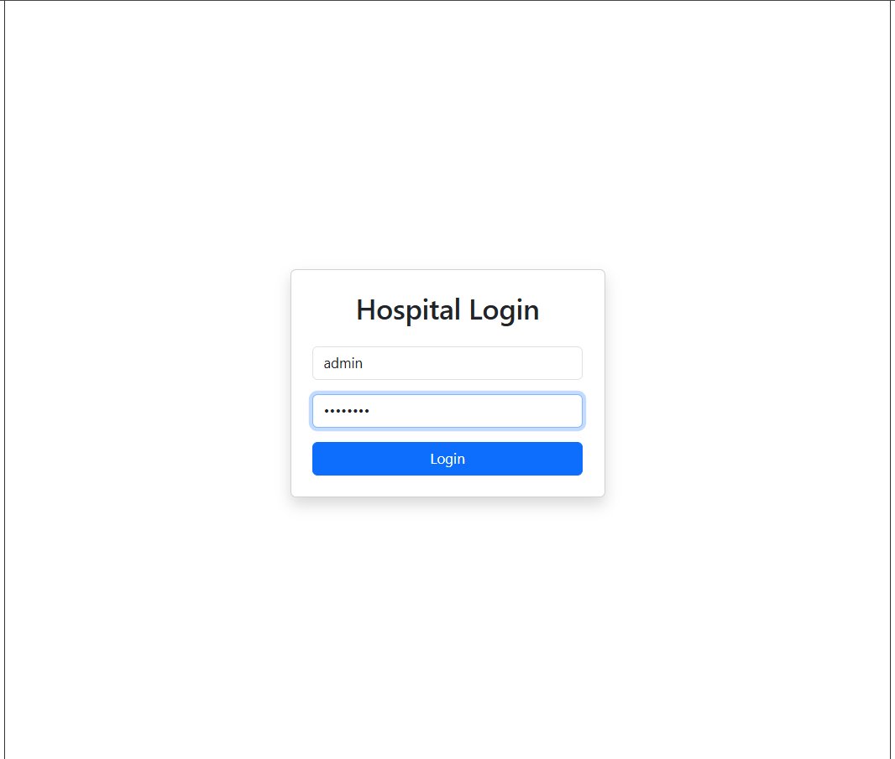
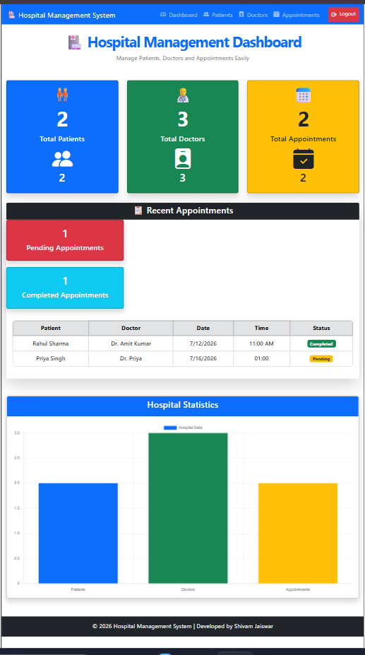
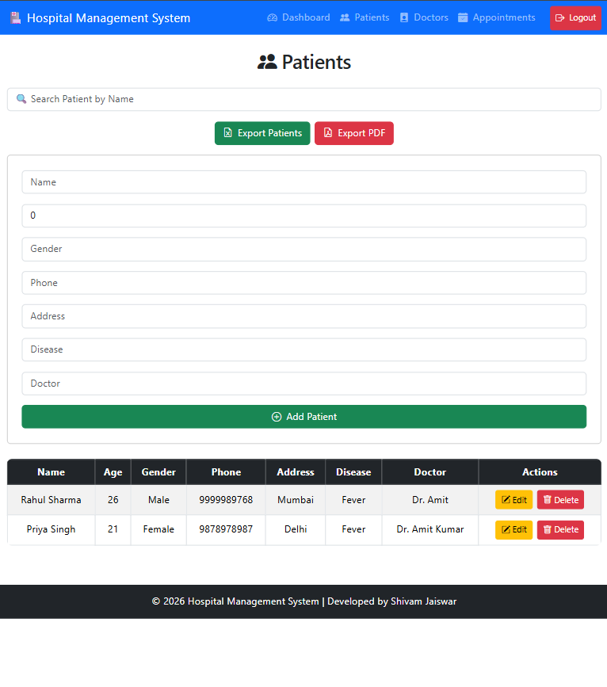
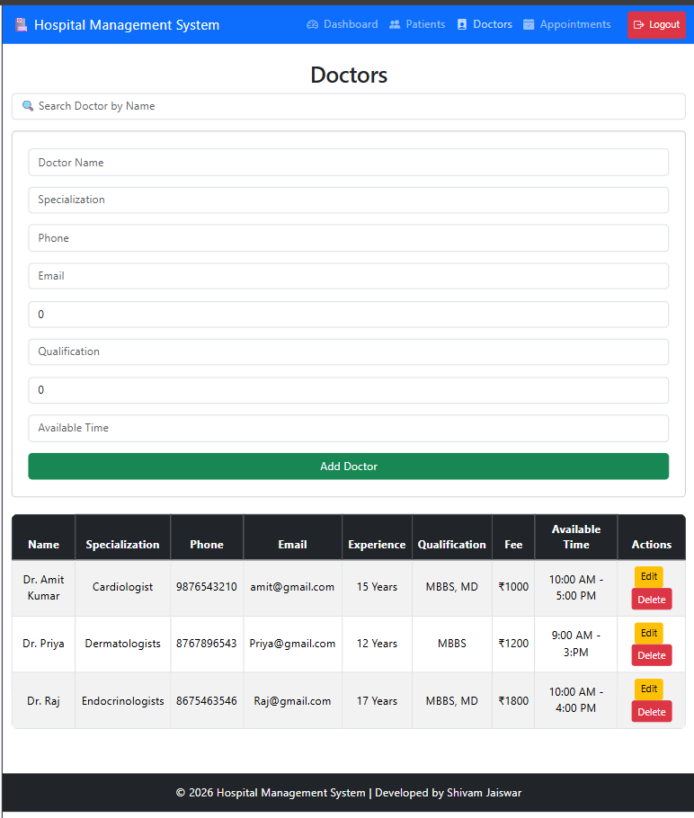
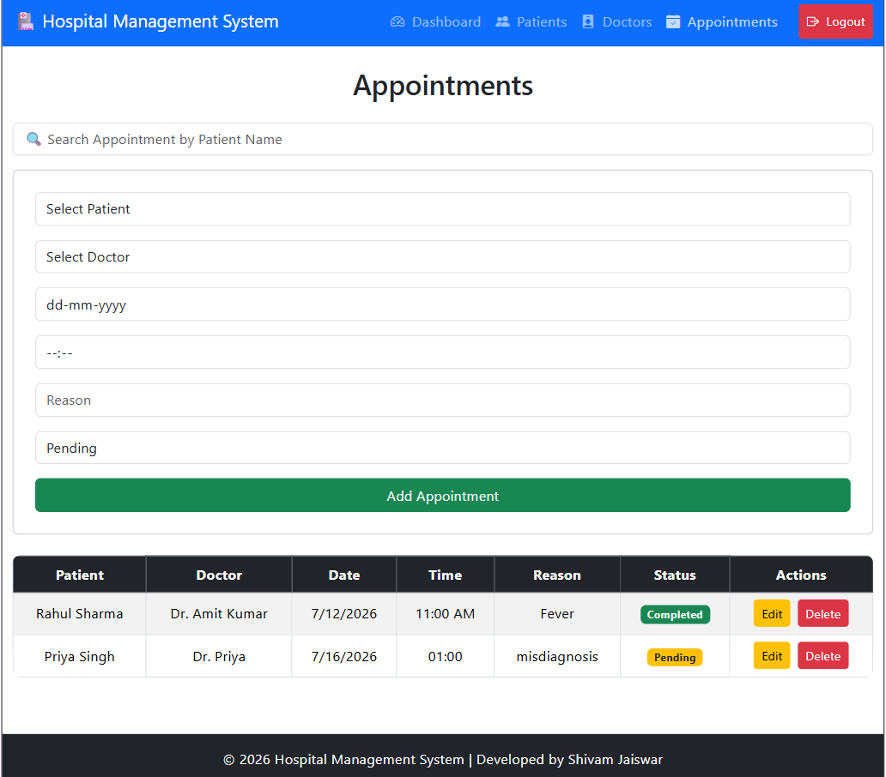
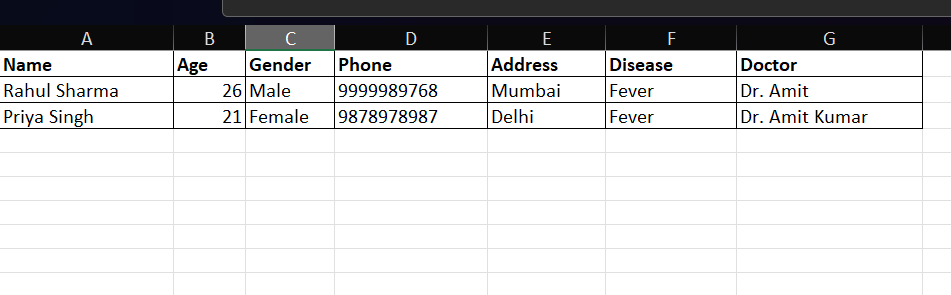
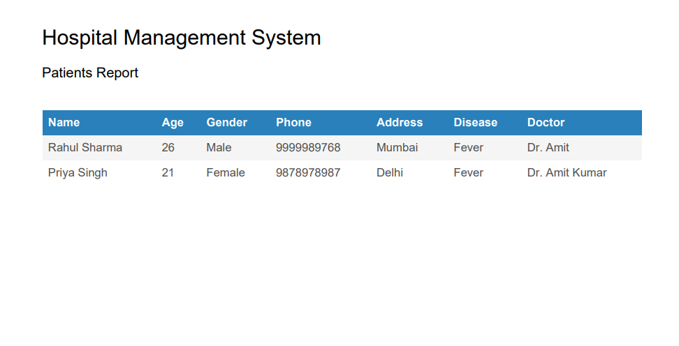

# 🏥 Hospital Management System

A Full Stack Hospital Management System developed using React, TypeScript, Node.js, Express.js, and MongoDB.

---

## 🚀 Features

- User Authentication
- Dashboard
- Patient Management
- Doctor Management
- Appointment Management
- Search Functionality
- Excel Import
- PDF Export
- Responsive UI

---

## 🛠 Tech Stack

### Frontend
- React
- TypeScript
- CSS
- Axios

### Backend
- Node.js
- Express.js

### Database
- MongoDB
- Mongoose

### Tools
- Git
- GitHub
- VS Code
- Postman

---

## 📂 Project Structure

```text
Hospital-Management-System
├── client
├── server
├── screenshots
├── README.md
└── .gitignore
```

---

## ⚙️ Installation

### Clone the repository

```bash
git clone https://github.com/shivamjaiswar117-cmd/Hospital-Management-System.git
```

### Install Frontend

```bash
cd client
npm install
npm run dev
```

### Install Backend

```bash
cd server
npm install
npm start
```

---

## 📸 Screenshots

### Login Page



### Dashboard



### Patient Page



### Doctor Page



### Appointment Page



### Excel Import



### PDF Export



---

## 👨‍💻 Author

**Shivam Jaiswar**